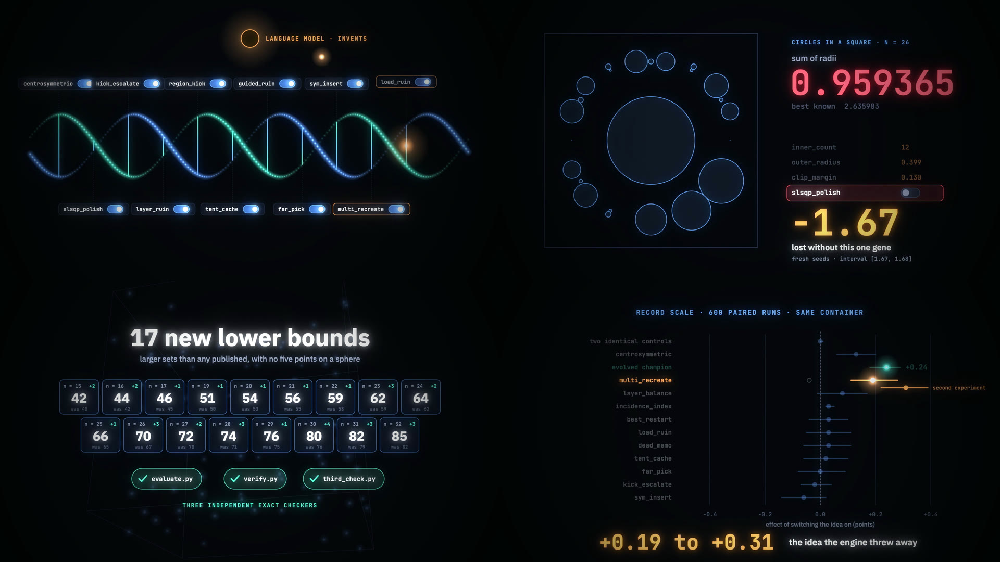
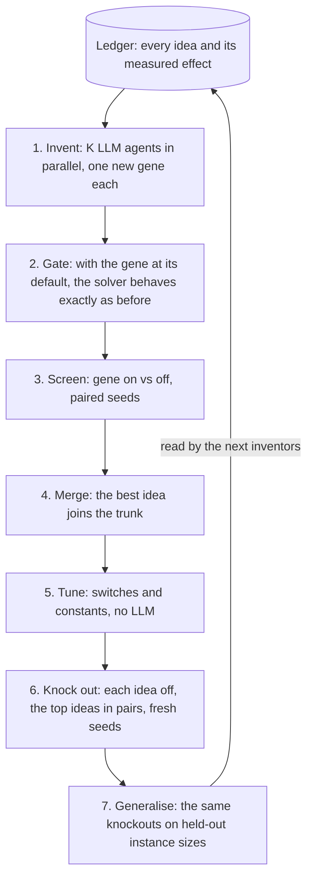

# MendelEvolve

[](https://youtu.be/129o5fS8ALY)

**▶ [Watch the 2-minute film](https://youtu.be/129o5fS8ALY)** · [the full film (3 min)](https://youtu.be/r8c3jwGGm6c) ·
[4-minute walkthrough](https://youtu.be/QK4ZIf9EN-4) · [2-minute walkthrough](https://youtu.be/zSHn5K7N-uw) ·
**[live site](https://hashkanna.github.io/mendel-evolve/)** · [all results](RESULTS.md)

**Genetics for algorithm discovery.** MendelEvolve (Mendel for short; the command is `mendel`) is an
autoresearch framework that evolves *ideas* instead of whole programs, and measures what each idea is worth.

Evolutionary coding agents such as AlphaEvolve and OpenEvolve mutate programs and keep the high scorers.
They find good algorithms, but afterwards nobody can say which idea produced the result. A study of their
search traces ([What Do Evolutionary Coding Agents Evolve?](https://arxiv.org/abs/2605.20086), May 2026) finds
that a high score can come from new structure, a re-tuned strategy, recombined known ideas or overfitting to
the evaluator, and that about 30% of the lines added during search are lines deleted earlier. Another
([Evolution or Illusion?](https://arxiv.org/abs/2609.19799), September 2026) shows that which method looks
best depends on how the budget is split between seeds and iterations. They are Darwin without Mendel:
selection, but no genes.

In Mendel every idea is a **gene**: a named switch in the solver with a stated hypothesis.

- An LLM agent only **invents** genes. It does not tune constants and it measures nothing.
- Classical search **recombines** genes and **tunes** their constants, with no LLM calls.
- **Knockouts** (switching one idea off, with paired seeds) give a measured effect with an interval for each
  idea in the solver, an interaction map for the leading ideas, and a test of whether each kept idea
  generalises to instance sizes it was not selected on.
- The resulting **ledger** is what the next inventors read, and it is the explanation of the result. Whether
  reading it makes the inventors search better is a separate question, tested in [RESULTS.md](RESULTS.md).

Built at the London AI x Science Hackathon, 3-4 October 2026, for the track "AI Automated Discovery of
Algorithms". Everything here was written during the event.

## Results at a glance

Details, verification and limits are in [RESULTS.md](RESULTS.md); read-only snapshots of the runs are at
https://hashkanna.github.io/mendel-evolve/.

**Watch it:** [the 2-minute film](https://youtu.be/129o5fS8ALY) · [the full film, 3 minutes](https://youtu.be/r8c3jwGGm6c) · [4-minute walkthrough with screen recordings](https://youtu.be/QK4ZIf9EN-4) · [2-minute walkthrough](https://youtu.be/zSHn5K7N-uw). Every frame of the films is drawn from the real data; the walkthroughs' screen recordings are real runs; the narration is synthetic speech.

- **Problem 60 of Tao et al. (no 5 points on a sphere): apparently new lower bounds at 17 grid sizes** from
  n = 15 to 32, and first point sets for n = 33 to 40. Every set passes three independent exact checkers.
- **Where those records came from, measured.** Eight from the hand-written seed solver, four from the solver
  the engine evolved, three from searches with the LLM idea `multi_recreate` switched on, and two from other
  idea arms. Which search found a set says little, so we ran knockouts at record scale, with every arm of a seed in one
  container (600 paired runs per arm, fresh seeds):
  one switch of the seed solver is worth +0.13 points and takes the share of record-beating runs from 10% to
  34%; the engine's evolved champion is worth +0.24 over the seed solver; and one LLM idea, `multi_recreate`,
  is worth +0.19 to +0.31.
- **What the engine's own quick screens said about those three: nothing.** They measured the switch at 0.00,
  the champion at +0.10 inside the noise, and they rejected `multi_recreate` at -0.04. The
  [chart](https://hashkanna.github.io/mendel-evolve/record-scale.html) shows every tested idea measured both
  ways, and RESULTS.md says why the quick screens could not see it.
- **Problem 59 (no isosceles triangles): 58-point sets in the 32 x 32 grid**, where 56 is reported as the best.
  DeepMind's own verifier accepts them.
- **Circle packing, n = 26: the best known value, 2.635983**, starting from OpenEvolve's initial program with no
  hints. One gene carries it: knocking it out costs 1.67 on the training sizes and 1.5 to 1.9 on held-out sizes.
- **Explaining another system.** `mendel explain` cut a program evolved by OpenEvolve into five switches: one
  of them, the optimiser its prompt recommends by name, is 99% of the gain, and two do nothing.
- **Ease of use.** Five outside coding agents (Devin sessions), given only this README and PROTOCOL.md, each added a new
  benchmark with a solver, an attribution run and a verified record search in about 20 to 45 minutes. Their
  five packs are merged, so the repository holds ten problem packs and a toy with known ground truth.

## How it works



1. **Invent.** K headless agent sessions each get a copy of the current solver, the problem statement and the
   ledger, and add exactly one new gene. Each session looks through a different lens (throughput, structure,
   search dynamics, construction, wildcard) so that parallel proposals differ. Ideas typed in by a person go
   through the same path and are credited to that person.
2. **Gate.** The invariance rule: with the new gene at its default, the solver must behave exactly as before
   (same random stream, same output). This is what makes a later knockout a clean intervention. A gene that
   fails is rejected and the reason is recorded.
3. **Screen.** Gene on versus gene off, in the current champion's context, with paired seeds and a 95%
   bootstrap interval.
4. **Merge.** The best positive idea joins the trunk. Other positive ideas are queued to be ported.
5. **Tune.** Optuna searches over all switches and constants. No LLM calls.
6. **Knock out.** Every active idea is switched off in turn, and the top ideas in pairs, on seeds the tuner
   never saw. This gives each idea's causal effect and the synergy between ideas.
7. **Generalise.** The same knockouts on held-out instance sizes label each idea `general`, `specific`,
   `neutral`, `harmful` or `inconclusive`.
8. **Account.** The run reports where the gain came from: the seed solver, tuning alone, the ideas, and extra
   compute; and what it cost in LLM calls, dollars and CPU-hours.

The contract between a problem, a solver and the run state is in [PROTOCOL.md](PROTOCOL.md). Solvers can be
written in any language; the two shipped ones are C and Python.

## Install

Requires Python 3.11+, [uv](https://docs.astral.sh/uv/) and a C compiler.

```bash
uv sync --extra modal --extra dev
uv run pytest -q                      # 46 tests on a toy problem with known ground truth
```

Optional: the [Claude Code CLI](https://claude.com/claude-code) for the idea inventor, and a
[Modal](https://modal.com) account for fan-out (`uv run modal setup`).

## Run

```bash
# 1. No LLM, no cloud: tune and attribute the seed solver of the toy problem. Tuning runs only in
#    generations divisible by --tune-every (default 2), so a one-generation run needs --tune-every 1.
uv run mendel run --solver tests/fixtures/solvers/toy --problem tests/fixtures/problems/toy \
    --run-id toy --generations 1 --k 0 --iters 150 --seeds 3 --heldout-seeds 2 --tune-trials 16 \
    --tune-every 1

# 2. With the inventor: two new ideas per generation.
uv run mendel run --solver tests/fixtures/solvers/toy --problem tests/fixtures/problems/toy \
    --run-id toy-llm --generations 2 --k 2 --iters 150 --seeds 3 --heldout-seeds 2 --tune-trials 16

# 3. The real thing: Tao et al. problem 60, evaluations on Modal.
uv run mendel run --solver solvers/no5sphere --problem problems/no5sphere --run-id p60 \
    --generations 12 --k 4 --executor modal --time 10 --seeds 12 --heldout-seeds 8 --gate-iters 8000

# Watch it.
uv run mendel serve                   # http://127.0.0.1:8765

# Add your own idea; it becomes a gene and gets measured like any other.
uv run mendel idea --run p60 --author you "prefer points whose removal frees the most blocked cells"

# Knock out one idea live.
uv run mendel knockout --run p60 --gene centrosymmetric --quick

# Run the champion at scale and keep verified certificates.
uv run python -m mendel.campaign --solver runs/p60/trunk/gen012 --problem problems/no5sphere \
    --instances n17 n18 n19 n20 --seeds 32 --time 600 --executor modal --out runs/p60-campaign
```

## Benchmarks in this repository

| Problem | Solver | Evaluator | Why it is here |
|---|---|---|---|
| `no5sphere`: largest subset of an n x n x n grid with no 5 points on a sphere or plane (Tao et al., [problem 60](https://google-deepmind.github.io/alphaevolve_repository_of_problems/problems/60.html)) | C, ruin-and-recreate | exact integer determinants over every 5-subset, plus an independent Bareiss checker | open problem with many instance sizes and recent public records |
| `circle_packing`: n circles in the unit square, maximise the sum of radii | Python; the seed is a port of OpenEvolve's initial program | exact rational feasibility, no tolerance | the standard benchmark; head-to-head with OpenEvolve from the same starting point |
| `noisosceles`: largest subset of an n x n grid with no isosceles triangle (Tao et al., [problem 59](https://google-deepmind.github.io/alphaevolve_repository_of_problems/problems/59.html)) | C, local search with symmetry switches | exact integer distances, plus an independent perpendicular-bisector checker | a second grid problem, where the seed solver's own switches have large, interacting effects |
| `heilbronn`: point sets that maximise the smallest triangle area (Tao et al., problems 48 and 49) | Python | checked against all 100 published sets | a benchmark with many published instances; no record claimed |
| `autocorr3`: third autocorrelation inequality, upper bound (Tao et al., problem 6.4) | Python | exact, checked against the public leaderboard's verifier | a continuous problem with a live leaderboard; no record claimed |
| `distratio`: n points with the smallest ratio of largest to smallest distance (Tao et al., problem 50) | Python | exact, checked against the public leaderboard's solutions | added by an outside agent from the docs alone ([#1](https://github.com/hashkanna/mendel-evolve/pull/1)); no record claimed |
| `flatpoly`: flat polynomials with +-1 coefficients (Tao et al., problem 6.28) | C | exact, checked against the public leaderboard's solutions | added by an outside agent ([#2](https://github.com/hashkanna/mendel-evolve/pull/2)); no record claimed |
| `diffbasis`: difference bases (Tao et al., problem 6.7) | C | exact integers | added by an outside agent ([#3](https://github.com/hashkanna/mendel-evolve/pull/3)); no record claimed |
| `minoverlap`: Erdos minimum overlap, upper bound (Tao et al., problem 6.5) | Python | checked against the public leaderboard's solutions | added by an outside agent ([#4](https://github.com/hashkanna/mendel-evolve/pull/4)); no record claimed |
| `ringloading`: ring loading (Tao et al., problem 61) | C | exact | added by an outside agent ([#5](https://github.com/hashkanna/mendel-evolve/pull/5)); no record claimed |
| `toy` (under `tests/fixtures`) | Python | exact | known ground truth for testing attribution |

### Adding a problem

A problem pack needs two files, `problem.toml` and `evaluate.py`. The packs in `problems/` also have a
`verify.py`, most a `records.json`, and some a `selftest.py` and a `published/` directory; PROTOCOL.md says
what reads them. A solver is a program that accepts `--config --instance --seed (--time | --iters) --out`,
plus a `genes.json` and a three-line `mendel.toml`. See [PROTOCOL.md](PROTOCOL.md), which also says how to
check a new solver's switches with `mendel gate`. `tests/fixtures` has the smallest complete example and
`problems/no5sphere` has every optional file.

## Repository layout

| Path | What is there |
|---|---|
| `mendel/` | the framework: `engine.py` (the loop), `inventor.py` (LLM agents), `experiments.py` and `stats.py` (paired screens, knockouts, intervals), `tune.py` (Optuna), `executor.py` and `backends/` (local and Modal), `ledger.py`, `explain.py`, `campaign.py` (record searches), `dashboard/`, `cli.py` |
| `problems/` | ten problem packs: statement, exact evaluator, independent verifier, published records |
| `solvers/` | seed solvers whose ideas are named switches (`genes.json`) |
| `results/` | every claimed result with its certificate and the scripts that check it |
| `tests/` | 46 tests on a toy problem with known ground truth |
| `configs/`, `scripts/` | experiment arms and helpers (paired searches, record collection, site refresh) |
| `baselines/` | the OpenEvolve comparison runs |
| `docs/` | the site at https://hashkanna.github.io/mendel-evolve/ (run snapshots, charts, the 58-point sets checked in the browser) |
| `media/` | how the videos and the film are built |
| [PROTOCOL.md](PROTOCOL.md), [RESULTS.md](RESULTS.md), [TODO.md](TODO.md), [PITCH.md](PITCH.md) | the contract for new problems and solvers, all results with their limits, next steps, the pitch |

## Results

Results from the hackathon runs are in [RESULTS.md](RESULTS.md). What we would do next, including the
framework changes the weekend showed are needed, is in [TODO.md](TODO.md).

## Design notes

**Research efficiency.** LLM calls scale with the number of ideas, not the number of evaluations: tuning,
recombination and attribution are plain compute. Every evaluation is cached by solver version, configuration,
instance, seed and budget. On Modal, the two arms of a paired comparison run in the same container so that
hardware differences cancel. The run state records LLM calls, dollars, CPU-seconds and evaluations.

**Compute on Modal.** Every solver evaluation runs on [Modal](https://modal.com). The plan caps containers,
not cores, so each container runs 8, 16 or 64 jobs side by side.
- Solver sources and the trusted evaluator travel with each batch, named by a hash of their contents, so a
  new solver version needs no redeploy; containers compile it on first sight.
- Batches keep both arms of a paired comparison in the same container, so hardware differences cancel.
- There are separate lanes over the same code, each with its own queue: `run_batch_x8` and `run_batch_e8` for
  the engine's short paired experiments, `run_batch_bg_x16` and `run_batch_bg_x64` for long record searches,
  so a search cannot starve an engine.
- The inventor agents' own trial runs go to Modal as well, which keeps a laptop usable while a dozen agents
  work and keeps their timings meaningful.
- Every executor has a hard cap on core-hours, so an overnight loop cannot spend the whole credit.

The first two record searches on problem 60 (480 runs of 120 CPU-seconds) cost about $0.90 in total.

**Trust.** Evaluators are exact and live outside the inventor's reach. The inventor agent can edit only its
sandbox copy and run three harness commands; it cannot run arbitrary shell commands. The engine re-runs the
gate itself rather than believing the agent. The campaign runner re-checks every remote result locally,
writes a certificate only for a result that passes, runs the pack's independent `verify.py` on it when there
is one, and does not announce a tie with a published value as a record.

**Honest attribution.** Knockouts use seeds the tuner never saw, because measuring a selected configuration
on the seeds that selected it biases every effect upward. Intervals are reported and an effect whose interval
spans zero is labelled inconclusive, not failed. Each screening and knockout also records how many seed pairs
differed at all, so an idea that never executed is not mistaken for one that has no effect. The attribution
seeds are reused from one generation to the next and their results reach the next inventors through the
ledger, so they are validation data, not a final test: the numbers we quote as final for problem 60 come from
separate searches on seeds and instance sizes the engine never used.

**Limits.**
- An idea that needs a whole-program rewrite does not fit behind a switch.
- Leave-one-out effects depend on context; pairwise knockouts only cover the top ideas.
- Integer-valued objectives make small effects hard to see without many seeds. On problem 60 the default
  screen (48 seed pairs at 45 seconds) resolves about 0.2 points, and the one switch that finds records is
  worth about that much.
- The engine selects on the mean of short runs. A record is the best of hundreds of long runs, and an idea can
  change that tail without moving the mean much. Selecting on the rate of runs above a target is not built yet;
  `results/no5sphere/tail_effect.py` computes that statistic after the fact.
- Generality labels and pairwise interactions exist only for ideas that are on in the champion. Seed
  switches start off, so until a merge or the tuner turns one on it is measured as a knock-in (on versus
  off) and has no label.
- Solvers are LLM-written code that runs on your machine in the sandbox tools; use the Modal executor, or a
  container, if that matters to you.

## Related work

Mendel combines ingredients that exist separately, and we want to be exact about which.

- The efficiency idea, an LLM writing a parameterised program that a non-LLM search explores, is from
  [X-evolve](https://arxiv.org/abs/2508.07932) and [LLaMEA-HPO](https://arxiv.org/abs/2410.16309).
- Keeping a memory of which changes moved the score is in
  [Component-Aware Feedback](https://arxiv.org/abs/2609.38639) and [DeltaEvolve](https://arxiv.org/abs/2602.02919),
  from differences between a program and its parent.
- The questions Mendel is built to answer come from two studies.
  [What Do Evolutionary Coding Agents Evolve?](https://arxiv.org/abs/2605.20086) (the EvoTrace dataset) asks
  which mechanism a score gain reflects and tests it by replaying search states with interventions after the
  fact; Mendel builds the interventions into the search.
  [Evolution or Illusion? Rethinking Evaluation in LLM Evolutionary Search](https://arxiv.org/abs/2609.19799)
  shows that rankings of methods change with the split of the budget between seeds and iterations. Our
  problem 60 result is an instance of that: the evolved solver looks neutral at 48 short runs and better at
  1,600 long ones.

What we have not found elsewhere, to our knowledge: interventional attribution inside the search loop
(knocking out every idea of every champion, singly and in pairs), a representation that forces each idea
into a named switch with a hypothesis so that such interventions are possible, and a per-idea test of
generalisation across instance sizes.

## Credits

[OpenEvolve](https://github.com/algorithmicsuperintelligence/openevolve) (Apache-2.0): the circle packing
seed solver is a port of its initial program, and it is our baseline.
[Optuna](https://optuna.org) for tuning, [Modal](https://modal.com) for compute,
[Claude Code](https://claude.com/claude-code) for the inventor agent, [Devin](https://devin.ai) for the
ease-of-use test (five sessions, pull requests #1 to #5). The videos' narration is Google Gemini (3.8 Flash TTS
and 3.8 Live) and the film's score is Google's Lyria.
Problem 60 and its published records: Georgiev, Gómez-Serrano, Tao and Wagner,
[Mathematical exploration and discovery at scale](https://arxiv.org/abs/2511.02864), and the contributors to
the [record threads](https://github.com/google-deepmind/alphaevolve_repository_of_problems/issues/6); their
certificates are used only to validate our evaluator.

## Citation

```bibtex
@software{mendelevolve2026,
  title  = {MendelEvolve: evolving ideas, not programs, and measuring what each idea is worth},
  author = {Sirchabesan, Kannappan},
  year   = {2026},
  url    = {https://github.com/hashkanna/mendel-evolve},
  note   = {Built at the London AI x Science Hackathon, 3-4 October 2026}
}
```
